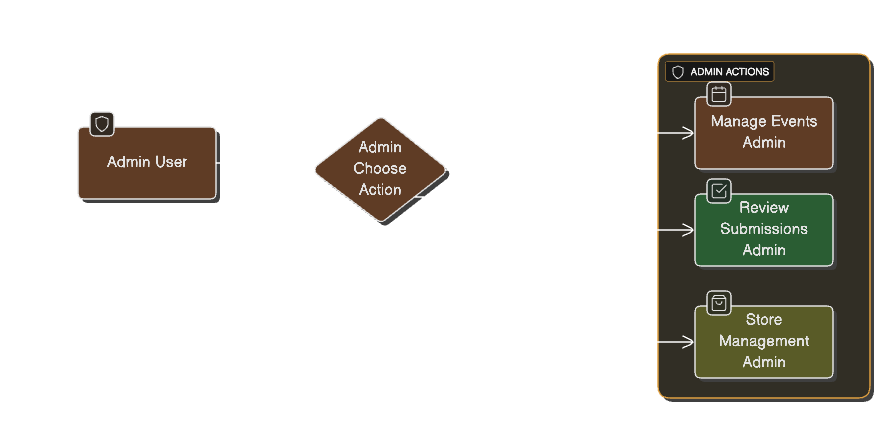
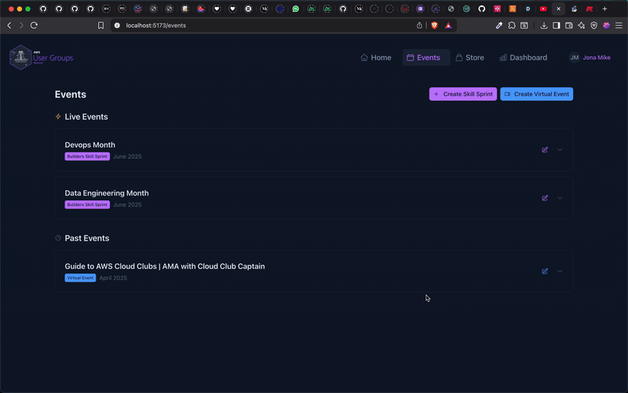

# AWS User Group Management Site

A comprehensive serverless web application built for managing AWS User Group activities, submissions, and rewards. This application leverages multiple AWS services to provide a scalable, secure, and intelligent platform for community management with AI-powered content analysis.

## 🎯 Problem Statement & Goals

### The Challenge
AWS User Groups and tech communities face significant challenges in managing member engagement, content quality, and reward systems:
- **Manual Content Review**: Time-consuming manual evaluation of submissions
- **Inconsistent Scoring**: Subjective assessment leading to unfair evaluations
- **Poor Engagement**: Lack of gamification and reward systems
- **Scalability Issues**: Traditional systems can't handle growing communities
- **Administrative Overhead**: Complex manual processes for event and user management

### Solution
This serverless platform addresses these challenges by providing:
- **AI-Powered Content Analysis**: Automated, consistent evaluation using Amazon Bedrock
- **Intelligent Workflow Management**: Step Functions orchestrate complex processing
- **Gamified Experience**: Points, leaderboards, and rewards drive engagement
- **Serverless Scalability**: Automatically scales with community growth
- **Streamlined Administration**: Comprehensive admin tools reduce manual work

### Target Audience
- **AWS User Groups** managing community activities and challenges
- **Tech Communities** running content creation programs

## 🏗️ Architecture Overview


This application follows a serverless-first architecture pattern using AWS services to create a highly scalable, cost-effective, and maintainable platform:

### Frontend Architecture
- **Framework**: Vue.js 3 with Nuxt UI components, Framekit (Json to Form rendering framework) and TypeScript
- **State Management**: Pinia stores for reactive data management
- **Authentication**: AWS Amplify integration with Cognito
- **Styling**: Tailwind CSS with responsive design
- **Build Tool**: Vite for fast development and optimized builds
- **Hosting**: Vercel

### Backend Architecture & AWS Services

#### Core Compute & API Services
1. **AWS Lambda** - 25+ serverless functions for all backend logic (Node.js 18.x runtime)
2. **Amazon API Gateway** - RESTful API with CORS support and error handling
3. **AWS Step Functions** - Orchestrates complex submission processing workflows

#### Database & Storage Services
4. **Amazon DynamoDB** - NoSQL database with 5 optimized tables:
   - **Users Table**: Email-based primary key with user profiles and statistics
   - **Events Table**: Composite key (eventId + date) for event management
   - **Submissions Table**: Submission tracking with user-based GSI
   - **Redemptions Table**: Redemption history with user email GSI
   - **Credits/Vouchers Table**: Rewards inventory with type-based GSI

5. **Amazon S3** - Secure file storage with public read access for files

#### Authentication & Security Services
6. **Amazon Cognito** - User authentication with custom attributes (linkedinurl, githuburl)
7. **AWS IAM** - Fine-grained access control with least privilege principles

#### AI & Analytics Services
8. **Amazon Bedrock** - AI content analysis using Claude 3.5 Sonnet model
9. **Amazon SES** - Automated email delivery for notifications

#### Messaging & Integration Services
10. **Amazon SQS** - Asynchronous email processing queue

#### Infrastructure & Deployment Services
11. **AWS SAM (Serverless Application Model)** - Primary deployment framework for this application
12. **AWS CloudFormation** - Resource provisioning and stack management

## 🎯 User and Admin Flows

### User Flow


**User Journey:**
1. **Registration/Login** → Cognito authentication with profile creation
2. **Profile Setup** → Add LinkedIn/GitHub links and personal information
3. **Browse Events** → View available community events and challenges
4. **Submit Content** → Upload blog posts or video tutorials
5. **Track Progress** → Monitor submission status and AI analysis results
6. **Earn Points** → Receive points for approved submissions
7. **Redeem Rewards** → Use points to claim credits and vouchers
8. **View Leaderboard** → Check community ranking and achievements

### Admin Flow


**Admin Journey:**
1. **Admin Login** → Enhanced access with administrative privileges
2. **Event Management** → Create, update, and manage community events
3. **Submission Review** → Review submissions with AI analysis insights
4. **Manual Scoring** → Override AI scores and provide custom feedback
5. **User Management** → Monitor user activity and manage accounts
6. **Rewards Management** → Upload and manage credits/vouchers inventory

## 🚀 Features and Functionality

### Core Platform Features

#### 1. **User Management System**
- **Registration & Authentication**: Secure user onboarding via Amazon Cognito
- **Profile Management**: Comprehensive user profiles with social media integration
- **Role-Based Access**: Differentiated access for regular users and administrators
- **User Analytics**: Track user engagement and submission history

#### 2. **Event Management**
- **Event Creation**: Admin-controlled event lifecycle management
- **Event Categories**: Support for different types of community events
- **Submission Tracking**: Link submissions to specific events

#### 3. **Intelligent Submission Processing**
- **AI-Powered Analysis**: Automated content evaluation using Amazon Bedrock
- **Quality Scoring**: AI-generated scores for Relevance, Quality, and Originality
- **Workflow Orchestration**: Step Functions manage complex processing pipelines
- **Real-time Status**: Track submission processing in real-time

#### 4. **Admin Dashboard**
- **Submission Review**: Comprehensive review interface with AI insights
- **Manual Override**: Admin can approve/reject submissions with custom scoring
- **Analytics Dashboard**: Real-time statistics and performance metrics

#### 5. **Rewards & Gamification System**
- **Points System**: Earn points for approved submissions
- **Credits & Vouchers**: Redeemable rewards for active participants
- **Leaderboard**: Community ranking based on points and contributions
- **Store Interface**: Redeem points for various rewards
- **Automated Notifications**: Email confirmations for redemptions

#### 6. **File Management**
- **Secure Upload**: Direct upload to S3 with proper access controls
- **Image Processing**: Support for user avatars and submission images
- **CDN Integration**: Fast content delivery via S3 public access

## 🔧 AWS Lambda Functions Usage

The application extensively uses **AWS Lambda** as the primary compute service, with **25+ specialized functions** handling different aspects of the platform:

### Lambda Function Categories

## 📋 Lambda Functions by Service Category

### 1. **Event Service**
Manages community events and their lifecycle:

- **[GetEventsFunction](src/handlers/getEvents.js)**: Retrieves all community events with filtering and sorting capabilities
- **[CreateEventFunction](src/handlers/createEvent.js)**: Creates new events with validation and admin authorization
- **[UpdateEventFunction](src/handlers/updateEvent.js)**: Modifies existing events with change tracking
- **[DeleteEventFunction](src/handlers/deleteEvent.js)**: Safely removes events with dependency checks

**Key Features:**
- Event lifecycle management from creation to completion
- Date-based organization and filtering
- Admin-only access controls for event management
- Integration with submission tracking system



### 2. **User Service**
Handles all user-related operations and profile management:

- **[CreateUserFunction](src/handlers/createUser.js)**: Registers new users with profile initialization
- **[GetUserFunction](src/handlers/getUser.js)**: Retrieves individual user profiles with statistics
- **[GetUserByEmailFunction](src/handlers/getUserByEmail.js)**: Email-based user lookup for authentication
- **[GetAllUsersFunction](src/handlers/getAllUsers.js)**: Admin function for user management and analytics
- **[UpdateUserFunction](src/handlers/updateUser.js)**: Profile updates including social media links

**Key Features:**
- Comprehensive user profile management
- Social media integration (LinkedIn, GitHub)
- Points and submission tracking
- Admin user management capabilities
- Secure user data handling with DynamoDB


### 3. **File Service**
Manages file uploads and storage operations:

- **[UploadFileFunction](src/handlers/uploadFile.js)**: Secure file upload to S3 with validation and access control

**Key Features:**
- Direct S3 upload with presigned URLs
- File type validation and size limits
- Public read access for user avatars
- CORS-enabled for web application integration
- Secure file naming and organization

### 4. **Submission Service**
Handles the complete submission lifecycle with AI-powered processing:

- **[CreateSubmissionFunction](src/handlers/triggerSubmissionProcessing.js)**: Initiates submission workflow via Step Functions
- **[SaveSubmissionFunction](src/handlers/saveSubmission.js)**: Persists submission data to DynamoDB
- **[ProcessVideoTutorialFunction](src/handlers/processVideoTutorial.js)**: Specialized processing for video content
- **[ProcessBlogPostFunction](src/handlers/processBlogPost.js)**: Handles blog post content extraction and validation
- **[AnalyzeContentFunction](src/handlers/analyzeContent.js)**: AI-powered content analysis using Amazon Bedrock
- **[GetSubmissionFunction](src/handlers/getSubmission.js)**: Retrieves individual submissions with full details
- **[GetSubmissionsFunction](src/handlers/getSubmissions.js)**: Bulk submission queries with filtering
- **[UpdateSubmissionFunction](src/handlers/updateSubmission.js)**: Admin review and scoring updates
- **[GetSubmissionStatsFunction](src/handlers/getSubmissionStats.js)**: Analytics and performance metrics
- **[DeleteSubmissionFunction](src/handlers/deleteSubmission.js)**: Secure submission removal with audit trail

**Key Features:**
- **AI-Powered Analysis**: Uses Amazon Bedrock (Claude 3.5 Sonnet) for intelligent content evaluation
- **Quality Scoring**: AI-generated scores for Relevance (0-100), Quality (0-100), and Originality (0-100)
- **Real-time Status Tracking**: Monitor submission processing stages
- **Admin Review Interface**: Manual override capabilities with detailed AI insights


### 5. **Credits and Voucher Redemption Service**
Manages the rewards system and gamification features:

- **[UploadCreditsVouchersFunction](src/handlers/uploadCreditsVouchers.js)**: Bulk upload of rewards from CSV files
- **[GetCreditsVouchersFunction](src/handlers/getCreditsVouchers.js)**: Retrieves available rewards with filtering
- **[RedeemCreditVoucherFunction](src/handlers/redeemCreditVoucher.js)**: Handles reward redemption with point deduction
- **[GetAllRedemptionsFunction](src/handlers/getAllRedemptions.js)**: Admin tracking of all redemptions
- **[GetUserRedemptionsFunction](src/handlers/getUserRedemptions.js)**: User-specific redemption history
- **[SendRedemptionEmailFunction](src/handlers/sendRedemptionEmail.js)**: Automated email notifications via SQS

#### Redemption Email Flow


**Key Features:**
- **Points-Based System**: Earn points for approved submissions (configurable scoring)
- **Flexible Rewards**: Support for both credits (500 points) and vouchers (800 points)
- **Automated Processing**: SQS-triggered email notifications for redemptions
- **Inventory Management**: Track available rewards and prevent double redemption
- **Admin Analytics**: Comprehensive redemption tracking and reporting
- **Email Integration**: Automated confirmation emails via Amazon SES


## 🔄 Step Functions Workflow

The submission processing leverages AWS Step Functions for intelligent workflow orchestration:


### Workflow Steps Explained:
1. **SaveSubmission** - Creates submission record in DynamoDB with unique ID
2. **CheckSubmissionType** - Routes to appropriate processor (Video/Blog)
3. **ProcessVideoTutorial/ProcessBlogPost** - Extracts content-specific metadata
4. **AnalyzeContent** - AI analysis using Bedrock (Claude 3.5 Sonnet) for scoring
5. **UpdateSubmissionWithAnalysis** - Updates record with AI scores and summary


## 🔐 Authentication Implementation

The application uses **Amazon Cognito User Pools** for secure authentication:

- **Email-based Authentication** with verification
- **Custom User Attributes** (LinkedIn, GitHub URLs)
- **JWT Token Management** via AWS Amplify
- **Role-based Access Control** (Admin/User permissions)
- **Strong Password Policy** with complexity requirements

## 🛠️ Technical Implementation Details

### Lambda Runtime Configuration
```yaml
Runtime: nodejs18.x
Memory: 128MB (standard), 256MB (AI functions)
Timeout: 30 seconds (standard), 60 seconds (AI analysis)
```

### Database Design Patterns
- **Single Table Design**: Optimized for DynamoDB best practices
- **Global Secondary Indexes**: Efficient querying patterns
- **Composite Keys**: Complex data relationships
- **Pay-per-Request**: Cost-optimized billing model

### AI Integration Details
```javascript
// Bedrock Integration
Model: Claude 3.5 Sonnet (us.anthropic.claude-3-5-sonnet-20240620-v1:0)
Analysis Metrics:
  - Relevance Score (0-100)
  - Quality Score (0-100)
  - Originality Score (0-100)
  - AI-Generated Summary
```

## 🚀 Deployment Instructions

### Prerequisites
- AWS CLI configured with appropriate permissions
- AWS SAM CLI installed (version 1.50+)
- Node.js 18.x or later
- Valid AWS account with required service access

### Step-by-Step Deployment

1. **Clone and Setup**
   ```bash
   git clone <repository-url>
   cd user-group-management-site
   npm install
   cd src && npm install && cd ..
   ```

2. **Environment Configuration**
   ```bash
   cp .env.example .env
   # Update .env with your AWS configuration
   ```

3. **SAM Deployment**
   ```bash
   sam build
   sam deploy --guided
   # Follow prompts for stack configuration
   ```

4. **Frontend Deployment**
   ```bash
   npm run build
   # Deploy to Vercel, Netlify, or your preferred hosting service
   ```

### Environment Variables
```bash
# Required Environment Variables
VITE_AWS_REGION=us-east-1
VITE_USER_POOL_ID=us-east-1_xxxxxxxxx
VITE_USER_POOL_CLIENT_ID=xxxxxxxxxxxxxxxxxx
VITE_API_ENDPOINT=https://api-id.execute-api.region.amazonaws.com/prod
```

## 📊 Monitoring and Analytics

### Built-in Analytics
- **Submission Statistics**: Total, pending, approved, rejected counts
- **User Engagement**: Active users, submission frequency, point distribution
- **Redemption Tracking**: Popular rewards, redemption patterns
- **AI Analysis Insights**: Content quality trends, scoring patterns

### CloudWatch Integration
- **Lambda Metrics**: Function duration, error rates, invocation counts
- **API Gateway Metrics**: Request volume, latency, error rates
- **DynamoDB Metrics**: Read/write capacity, throttling events
- **Step Functions Metrics**: Execution success rates, duration

## ✅ Current Features

- ✅ **User Authentication & Management** - Complete Cognito integration
- ✅ **Event Management System** - Full CRUD operations for community events
- ✅ **AI-Powered Submission Analysis** - Bedrock integration with Claude 3.5 Sonnet
- ✅ **Step Functions Workflow** - Automated submission processing pipeline
- ✅ **Admin Dashboard** - Comprehensive review and management interface
- ✅ **Points & Rewards System** - Complete gamification with credits/vouchers
- ✅ **Automated Email Notifications** - SQS/SES integration for redemptions
- ✅ **Leaderboard & Analytics** - Real-time statistics and user rankings
- ✅ **Secure File Upload** - S3 integration with proper access controls
- ✅ **Responsive Web Interface** - Vue.js 3 with Nuxt UI components
- ✅ **Infrastructure as Code** - Complete SAM template deployment

## 🚀 Future Enhancements

- 📅 **Meetup Integration** - Direct event posting to Meetup.com from events tab
- 📱 **Social Media Integration** - Auto-posting events to Twitter, LinkedIn, Facebook
- 🔄 **Blog Content Scraping** - Automatic content extraction from URLs
- 🔄 **Plagiarism Detection** - Integration with content similarity services
- 📊 **Advanced Analytics Dashboard** - Detailed engagement metrics and trends
- 💬 **Real-time Chat Integration** - Community discussion features
- 🤝 **Peer Review System** - Community-driven content evaluation
- 🏆 **Advanced Gamification** - Badges, achievements, and challenges
- 🌐 **Multi-Tenant Support** - Support for multiple user groups
- 📊 **Advanced Reporting** - Custom reports and data exports
- 🔄 **Workflow Customization** - Configurable approval processes


**Built with ❤️ for the AWS Community using AWS Serverless Technologies**

*This application demonstrates the power of serverless architecture combined with AI services to create intelligent, scalable community management platforms.*